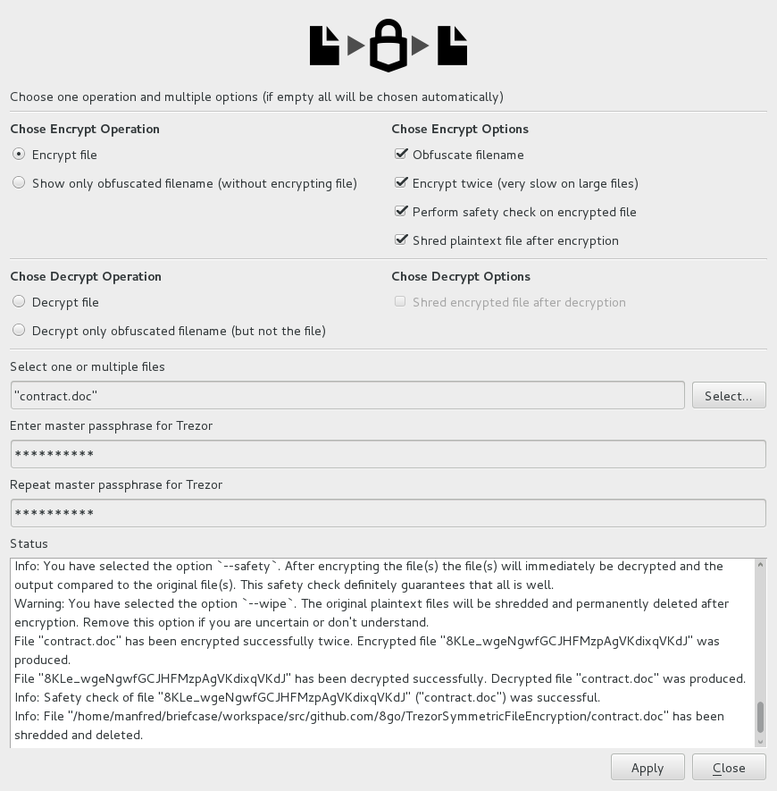

# 

# Trezor Symmetric File Encryption

**:star: :star: :star: Use your [Trezor](http://www.trezor.io/) device to symmetrically encrypt and decrypt files :star: :star: :star:**

**:lock: :unlock: :key: Hardware-backed file encryption with Trezor :key: :unlock: :lock:**

`TrezorSymmetricFileEncryption` is a small, simple tool that
allows you to symmetrically encrypt and decrypt files.

Note that it is software, currently in alpha stage.

# Features

  * Trezor convenience
  * Trezor security
  * One Trezor for all your needs: [gpg](https://github.com/romanz/trezor-agent), [ssh](https://github.com/romanz/trezor-agent), **symmetric encryption**, etc.
  * Encrypt your files for your use, guarantee your privacy
  * Requires confirmation button click on Trezor device to perform decrypt operation.
  * For the paranoid there is now an option to encrypt the file(s) twice.
    In any mode, the file is first AES encrypted on the PC with a key generated
    and en/decrypted by the Trezor device requiring a lick on the `Confirm`
    button of the Trezor. In the paranoid mode, the file is then encrypted
    a second time. This second encryption is done within the Trezor device
    and not on the PC, with no key ever touching the memory of the PC.
    The PC just feeds the file
    to the Trezor and receives the results, but the PC is not doing any actual
    encryption. The actual en/decryption takes place on the Trezor chip.
    This paranoid mode is significantly slower than the regular mode.
  * It supports both GUI mode and Terminal mode.
  * Since it is a program that has a full CLI (command line interface)
    it is easy to create scripts or to automate workflows. Keep in mind though
    that you will have to confirm on the Trezor by clicking its `Confirm` button.
  * Optionally obfuscates/encrypts filenames on encryption to hide meta-data
    (i.e. the file names)
  * Use it before and after you store sensitive information on
    DropBox, Google Drive or similar.

# Screenshot

Below a sample screenshot. More screenshots [here](screenshots).



# Build and runtime requirements

  * Use of passphrases must have been already enabled on your [Trezor](https://www.trezor.io) device.
  * [Python](https://www.python.org/)
  * PyCrypto
  * PyQt4
  * [trezorlib from python-trezor](https://github.com/trezor/python-trezor)

# Building

Even though the whole code is in Python, there are few Qt `.ui` form files that
need to be transformed into Python files. There is `Makefile`, you just need to run

    make

## Build requirements

PyQt4 development tools are necessary, namely `pyuic4` (look for packages named
like `pyqt4-dev-tools` or `PyQt4-devel`).

# Running

Run:

    python TrezorSymmetricFileEncryption.py

Run-time command line options are

```
TrezorSymmetricFileEncryption.py [-v] [-h] [-l <level>] [-t] [-e | -o | -d | -m | -n] [-2] [-s] [-w] [-p <passphrase>] [-r] [-R] <files>
    -v, --verion
            print the version number
    -h, --help
            print short help text
    -l, --logging
            set logging level, integer from 1 to 5, 1=full logging, 5=no logging
    -t, --terminal
            run in the terminal, except for a possible PIN query
            and a Passphrase query this avoids the GUI
    -e, --encrypt
            encrypt file and keep output filename as plaintext
            (appends .tsfe suffix to input file)
    -o, --obfuscatedencrypt
            encrypt file and obfuscate output file name
    -d, --decrypt
            decrypt file
    -m, --encnameonly
            just encrypt the plaintext filename, show what the obfuscated
            filename would be; does not encrypt the file itself;
            incompaible with `-d` and `-n`
    -n, --decnameonly
            just decrypt the obfuscated filename;
            does not decrypt the file itself;
            incompaible with `-o`, `-e`, and `-m`
    -2, --twice
            paranoid mode; encrypt file a second time on the Trezor chip itself;
            only relevant for `-e` and `-o`; ignored in all other cases.
            Consider filesize: The Trezor chip is slow. 1M takes roughly 75 seconds.
    -p, --passphrase
            master passphrase used for Trezor.
            It is recommended that you do not use this command line option
            but rather give the passphrase through a small window interaction.
    -r, --readpinfromstdin
            read the PIN, if needed, from the standard input, i.e. terminal,
            when in terminal mode `-t`. By default, even with `-t` set
            it is read via a GUI window.
    -R, --readpassphrasefromstdin
            read the passphrase, when needed, from the standard input,
            when in terminal mode `-t`. By default, even with `-t` set
            it is read via a GUI window.
    -s, --safety
            doublechecks the encryption process by decrypting the just
            encrypted file immediately and comparing it to original file;
            doublechecks the decryption process by encrypting the just
            decrypted file immediately and comparing it to original file;
            Ignored for `-m` and `-n`.
            Primarily useful for testing.
    -w, --wipe
            shred the inputfile after creating the output file
            i.e. shred the plaintext file after encryption or
            shred the encrypted file after decryption;
            only relevant for `-d`, `-e` and `-o`; ignored in all other cases.
            Use with extreme caution. May be used together with `-s`.
    <files>
            one or multiple files to be encrypted or decrypted

    All arguments are optional.

    All output files are always placed in the same directory as the input files.

    By default the GUI will be used.

    You can avoid the GUI by using `-t`, forcing the Terminal mode.
    If you specify filename, possibly some `-o`, `-e`, or `-d` option, then
    only PIN and Passphrase will be collected through windows.

    Most of the time TrezorSymmetricFileEncryption can detect automatically if
    it needs to decrypt or encrypt by analyzing the given input file name.
    So, in most of the cases you do not need to specify any
    de/encryption option.
    TrezorSymmetricFileEncryption will simply do the right thing.
    In the very rare case that TrezorSymmetricFileEncryption determines
    the wrong encrypt/decrypt operation you can force it to use the right one
    by using either `-e` or `-d` or selecting the appropriate option in the GUI.

    If TrezorSymmetricFileEncryption automatically determines
    that it has to encrypt of file, it will chose by default the
    `-e` option, and create a plaintext encrypted files with an `.tsfe` suffix.

    If you want the output file name to be obfuscated you
    must use the `-o` (obfuscate) flag or select that option in the GUI.

    Be aware of computation time and file sizes when you use `-2` option.
    Encrypting on the Trezor takes time: 1M roughtly 75sec. 50M about 1h.
    Without `-2` it is very fast, a 1G file taking roughly 15 seconds.

    For safety the file permission of encrypted files is set to read-only.

    Examples:
    # specify everything in the GUI
    TrezorSymmetricFileEncryption.py

    # specify everything in the GUI, set logging to verbose Debug level
    TrezorSymmetricFileEncryption.py -l 1

    # encrypt contract producing contract.doc.tsfe
    TrezorSymmetricFileEncryption.py contract.doc

    # encrypt contract and obfuscate output producing e.g. TQFYqK1nha1IfLy_qBxdGwlGRytelGRJ
    TrezorSymmetricFileEncryption.py -o contract.doc

    # encrypt contract and obfuscate output producing e.g. TQFYqK1nha1IfLy_qBxdGwlGRytelGRJ
    # performs safety check and then shreds contract.doc
    TrezorSymmetricFileEncryption.py -e -o -s -w contract.doc

    # decrypt contract producing contract.doc
    TrezorSymmetricFileEncryption.py contract.doc.tsfe

    # decrypt obfuscated contract producing contract.doc
    TrezorSymmetricFileEncryption.py TQFYqK1nha1IfLy_qBxdGwlGRytelGRJ

    # shows plaintext name of encrypted file, e.g. contract.doc
    TrezorSymmetricFileEncryption.py -n TQFYqK1nha1IfLy_qBxdGwlGRytelGRJ

    Keyboard shortcuts of GUI:
    Apply, Save: Control-A, Control-S
    Cancel, Quit: Esc, Control-Q
    Copy to clipboard: Control-C
    Version, About: Control-V
    Set encrypt operation: Control-E
    Set decrypt operation: Control-D
    Set obfuscate option: Control-O
    Set twice option: Control-2
    Set safety option: Control-T
    Set wipe option: Control-W
```

# Testing

Run the `Bash` script

    ./testTrezorSymmetricFileEncryption.sh 1K

or for a full lengthy test

    ./testTrezorSymmetricFileEncryption.sh

# FAQ - Frequently Asked Questions

**Question:** Shouldn't there be two executables? One for encrypting
and another one for decrypting?

**Answer:** No. There is only one Python file which does both encryption and decryption.
- - -
**Question:** What are the command line options?

**Answer:** See description above. But in the vast majority of cases you
do not need to set or use any command line options.
TrezorSymmetricFileEncryption will in most cases automatically detect
if it needs to encrypt or decrypt.
- - -
**Question:** Are there any RSA keys involved somewhere?

**Answer:** No. There are no RSA keys, there is no asymmetric encryption.
- - -
**Question:** Can I send encrypted files to my friends and have them decrypt them?

**Answer:** No. Only you have the Trezor that can decrypt the files.
**You** encrypt the files, and **you** decrypt them later.
TrezorSymmetricFileEncryption is not built for sharing.
For sharing encrypted files use asymmetric encryption
like [gpg](https://gnupg.org/).
By the way, Trezor supports gpg encryption/decryption.
In short, only the holder of the Trezor who also knows the PIN and the
TrezorSymmetricFileEncryption master password (= Trezor passphrase) can
decrypt the file(s).
- - -
**Question:** What crypto technology is used?

**Answer:** At the heart of it all is the
python-trezor/trezorlib/client.py/encrypt_keyvalue()
function of the Python client library of [Trezor](https://www.trezor.io)
and AES-CBC encryption.
- - -
**Question:** Is there a config file or a settings file?

**Answer:** No, there are no config and no settings files.
- - -
**Question:** Does TrezorSymmetricFileEncryption require online connectivity,
Internet access?

**Answer:** No.
- - -
**Question:** How many files are there?

**Answer:** If you have Python installed, then there are just a
handful of Python files. Alternatively, if you don't want to
install Python one can create a single-file-executable
with tools like [pyinstaller](www.pyinstaller.org). In that case you just have a
single-file-executablefile.
- - -
**Question:** In which language is TrezorSymmetricFileEncryption written?

**Answer:** [Python](https://www.python.org/).
- - -
**Question:** Do I need to have a [Trezor](https://www.trezor.io/) in
order to use TrezorSymmetricFileEncryption?

**Answer:** Yes, a Trezor is required.
- - -
**Question:** Is there any limit on the file size for encryption or decryption?

**Answer:** Yes. Currently it is 2G minus a few bytes. On old computers
with very little memory, it might be less than 2G due to memory limitations.
- - -
**Question:** Can I see the source code?

**Answer:** Yes, this is an open source software project.
You can find and download all source code from
[Github](https://github.com/8go/TrezorSymmetricFileEncryption) or
any of its forks.
- - -
**Question:** Does the TrezorSymmetricFileEncryption contain ads?

**Answer:** No.
- - -
**Question:** Does TrezorSymmetricFileEncryption cost money?

**Answer:** No. It is free, libre, and open source.
- - -
**Question:** Does TrezorSymmetricFileEncryption call home?
Send any information anywhere?

**Answer:** No. Never. You can also use it on an air-gapped computer if you
want to. It does not contain any networking code at all. It does not update
itself automatically. It cannot send anything anywhere.
- - -
**Question:** Does TrezorSymmetricFileEncryption have a backdoor?

**Answer:** No. Read the source code to convince yourself.
- - -
**Question:** How can I know that TrezorSymmetricFileEncryption does not contain a virus?

**Answer:** Download the source from
[Github](https://github.com/8go/TrezorSymmetricFileEncryption)
and inspect the source code for viruses. Don't download it from unreliable sources.
- - -
**Question:** Can someone steal or duplicate the key used for encryption or decryption?

**Answer:** No, the key never leaves the Trezor.  
- - -
**Question:** Can a keyboard logger steal a key?

**Answer:** No, it never leaves the Trezor.
- - -
**Question:** Can a screen grabber or a person looking over my shoulder steal a key?

**Answer:** No, it never leaves the Trezor.
- - -
**Question:** What can be stolen? How can it be stolen?

**Answer:** A virus or malware could steal your plain text file before you
encrypt it or after you decrypt it. Once you have a safe encrypted copy
you can consider shredding the plain text copy of the file(s). For extremely
sensitive information consider using an air-gapped computer or
a [LiveDvd OS](https://en.wikipedia.org/wiki/Live_DVD) if you have one available.
- - -
**Question:** Is TrezorSymmetricFileEncryption portable?

**Answer:** Yes. It is just a handful of Python files
or a single-file-executable.
You can move it around via an USB stick, SD card, email or cloud service.
- - -
**Question:** Can I contribute to the project?

**Answer:** Yes. It is open source.
Go to [Github](https://github.com/8go/TrezorSymmetricFileEncryption).
You can also help by getting the word out.
If you like it or like the idea please spread the word on Twitter, Reddit,
Facebook, etc. It will be appreciated.
- - -
**Question:** What if I lose my Trezor and my 24 Trezor seed words or
my TrezorSymmetricFileEncryption master password (= Trezor passphrase)?

**Answer:** Then you will not be able to decrypt your previously encrypted
file. For practical purposes you have lost those files. Brute-forcing is
not a viable work-around.
- - -
**Question:** What if I lose my Trezor or someone steals my Trezor?

**Answer:** As long as the thief cannot guess your TrezorSymmetricFileEncryption master
password (= Trezor passphrase) the thief cannot use it to decrypt your files.
A good PIN helps too. If the thief can guess your PIN and thereafter is able
to brute-force your TrezorSymmetricFileEncryption master password
(= Trezor passphrase) then he can decrypt your files. So, use a good PIN and
a good passphrase and you will be safe. After losing your Trezor you will need
to get a new Trezor to decrypt your files. Decryption without a Trezor device
could be done in pure software
knowing the 24 seed words and the passphrase, but that software has not been
written yet.
- - -
**Question:** On which platforms, operating systems is
TrezorSymmetricFileEncryption available?

**Answer:** On all platforms, operating systems where
[Python](https://www.python.org/) and PyQt4 is available: Windows, Linux, Unix,
Mac OS X. Internet searches show Python for Android and iOS,
but it has not been investigated or tested on Android or iOS.
Testing has only been done on Linux.
- - -
**Question:** Is it fast?

**Answer:** Regular mode (encrypting once) is fast; like any AES implementation.
Encrypting or decrypting a 1G file takes about 15 seconds, but
your mileage may vary as speed depends on CPU and disk speed. If you
encrypt a second time on the Trezor device itself, it is slow as the CPU
performance on the Trezor device is limited. Encrypting a second time
takes about 75 seconds per Megabyte.
- - -
**Question:** Are there any warranties or guarantees?

**Answer:** No, there are no warranties or guarantees whatsoever.
- - -
**Question:** More questions?

**Answer:** Let us know.
- - -

</> on :octocat: with :heart:
